# faaji-brew-afromart Introduction

An e-commerce app created for the purpose of meeting the assessment criteria of my final portfolio project 5 as a full-stack software developer at Code Institute, Dublin, Ireland. I built this fully functioning e-commerce website.

**Portfolio Project 5 - A final E-Commerce Project for a Level 5 Diploma in Full-Stack Software Development**
**Code Institute, Dublin**

---

# 🛍️ Faaji & Brew AfroMart

### An authentic West African lifestyle e-commerce platform

**[🌐 View the Live Site](https://faaji-brew-afromart-0cba904df962.herokuapp.com/)** &nbsp;•&nbsp; **[💻 View the Repository](https://github.com/Emmy-Dare274/faaji-brew-afromart)**

---

Faaji & Brew AfroMart is a full-stack e-commerce web application built with Django, selling authentic West African fabrics, spices, beads, jewellery, and homeware. It was born as a natural extension of Faaji & Brew Palace, a real restaurant whose guests kept asking where they could buy the fabrics on the walls and the spices used in the kitchen. This platform is that answer: a complete, secure, real-money-capable online store, built from scratch as a personal portfolio project for a Level 5 Diploma in Full-Stack Software Development.

Every feature described in this document is genuinely working on the live deployment, not a mockup. You can browse the catalogue, create a real account, add products to a basket, and complete an actual purchase using Stripe's test card system, right now, without needing to download or install anything.

## 📑 Table of Contents

1. [UX Design](#ux-design)
   - [Strategy](#strategy)
   - [Scope](#scope)
   - [Structure](#structure)
   - [Skeleton — Wireframes](#skeleton--wireframes)
   - [Surface — Design System](#surface--design-system)
2. [Agile Methodology & User Stories](#agile-methodology--user-stories)
3. [Features](#features)
   - [Navigation & Browsing](#navigation--browsing)
   - [Product Discovery](#product-discovery)
   - [Reviews](#reviews)
   - [Basket & Checkout](#basket--checkout)
   - [User Accounts](#user-accounts)
   - [Staff Tools](#staff-tools)
   - [Marketing & SEO](#marketing--seo)
   - [Future Features](#future-features)
4. [Database Schema](#database-schema)
5. [Marketing](#marketing)
6. [Technologies Used](#technologies-used)
7. [Testing](#testing)
8. [Bugs Found and Fixed](#bugs-found-and-fixed)
9. [Deployment](#deployment)
   - [Local Development](#local-development)
   - [Heroku Deployment](#heroku-deployment)
10. [Credits](#credits)

---

## 🎨 UX Design

This project was planned using the five-plane UX design model: Strategy, Scope, Structure, Skeleton, and Surface. Each plane's decisions fed directly into the next, from the earliest question of who the site is for, through to the exact shade of teal used on a button.

### Strategy

**Site goals:**
- Give West African diaspora customers, and anyone curious about the culture, a genuine, trustworthy place to buy real ingredients, fabrics, and handmade goods online
- Convert the goodwill already built by the Faaji & Brew Palace restaurant into a second, complementary revenue stream
- Build a store that feels warm and personal rather than like a generic template, reflecting the actual culture behind the products

**User goals:**
- Find a specific product quickly, whether browsing by category or searching directly
- Trust that a review is genuine, written by someone who actually bought the item
- Check out quickly and securely, with clear delivery costs shown upfront
- Track past orders and reorder favourites without re-entering everything from scratch
- Feel confident giving a business their card details, especially one they may not have heard of before

### Scope

The scope was deliberately kept to what a real small business actually needs to start selling online, rather than every feature a large marketplace might eventually want:

**In scope:** product catalogue with categories and variants, search and filtering, a persistent basket that survives login, secure card payment, verified purchase reviews, user accounts with saved addresses and order history, a staff-only management area for products and categories that doesn't require the Django admin, and a full SEO and accessibility pass.

**Out of scope for this version:** multi-currency support, third-party marketplace integrations (eBay, Amazon), a native mobile app, and multi-vendor seller accounts. These are noted honestly in [Future Features](#future-features) rather than left unmentioned.

### Structure

The site is organised around six independent Django apps, each owning one area of responsibility:

| App | Responsibility |
|---|---|
| `core` | Static pages — home, our story, FAQ, contact, legal pages, the 404 page, SEO infrastructure |
| `products` | The catalogue — categories, products, variants, images, reviews, and all staff management tools |
| `basket` | The shopping basket, for both guests and logged-in users |
| `checkout` | Address collection, Stripe payment, order creation, and the webhook that confirms payment server-side |
| `profiles` | User accounts, saved delivery details, order history, reordering, and wishlists |
| `marketing` | Newsletter signup and confirmation |

This separation means each app can be reasoned about, and tested, largely on its own — a change to how reviews work never risks breaking checkout, because they don't share code beyond the shared `Product` model itself.

### Skeleton — Wireframes

Wireframes were created before any code was written, to settle on page layout and user flow ahead of time. The final build followed these closely, though a handful of pages (My Account, staff tools) grew additional functionality once the underlying data model was in place.

<strong>Click to view all 12 wireframes</strong>

#### Home Page
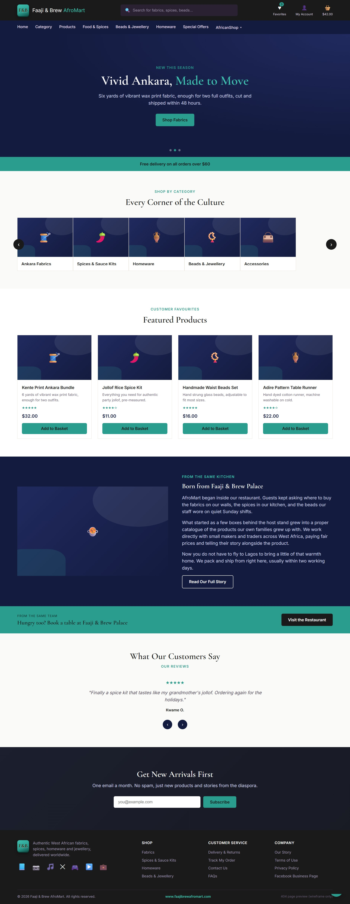

#### Category Page
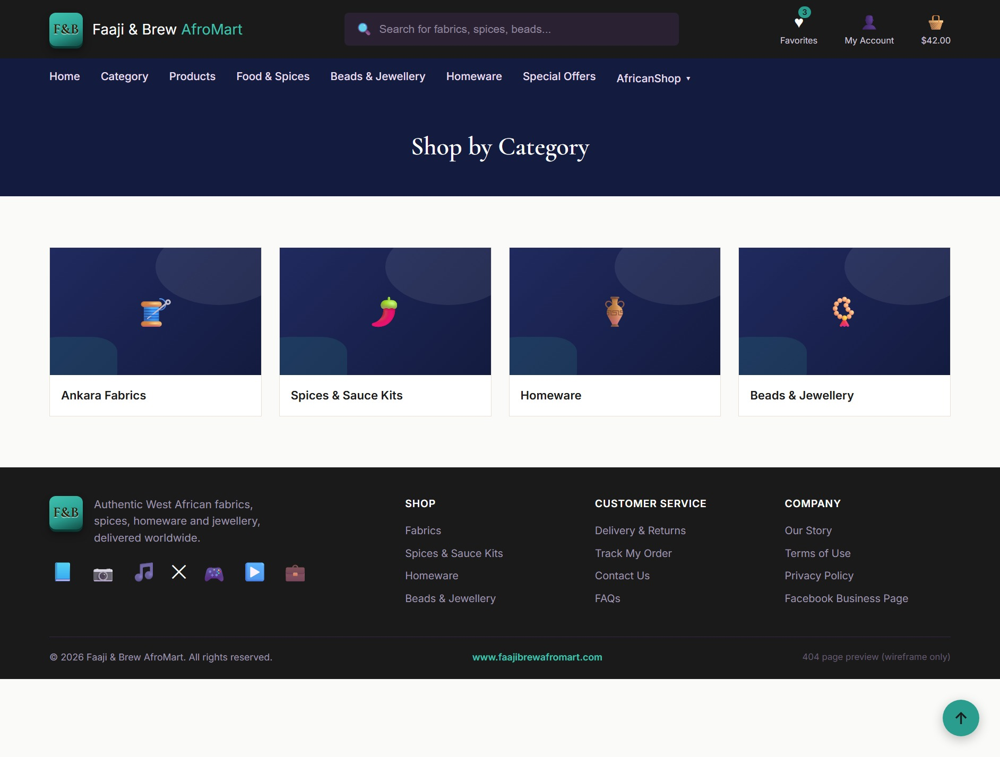

#### Products Page
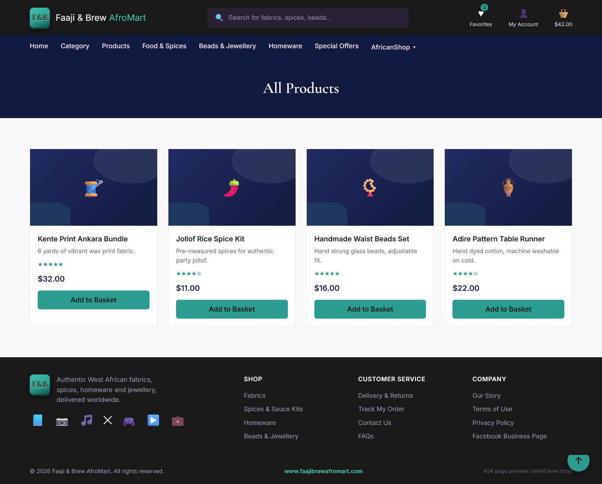

#### Product Detail Page
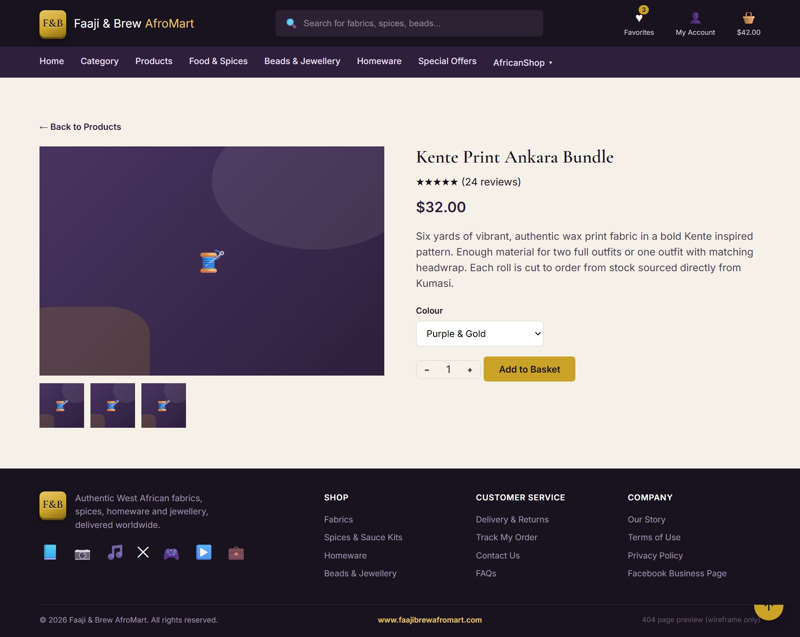

#### Our Story Page
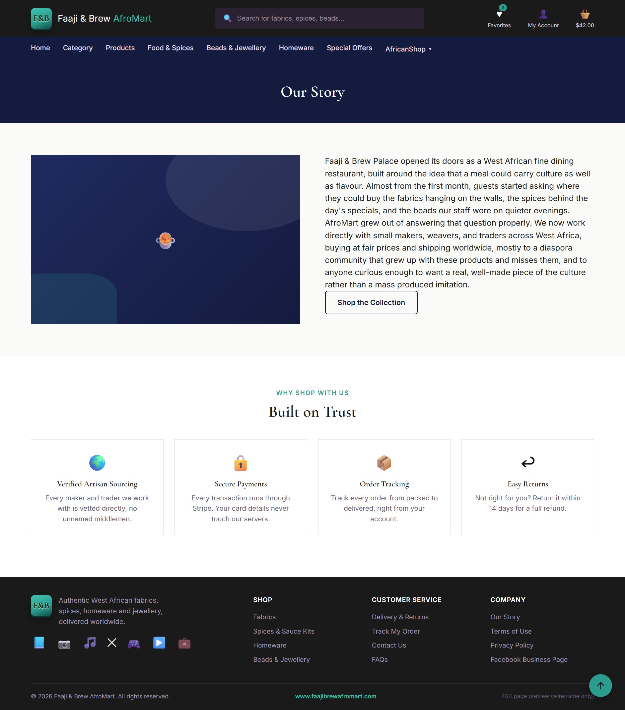

#### Basket Page
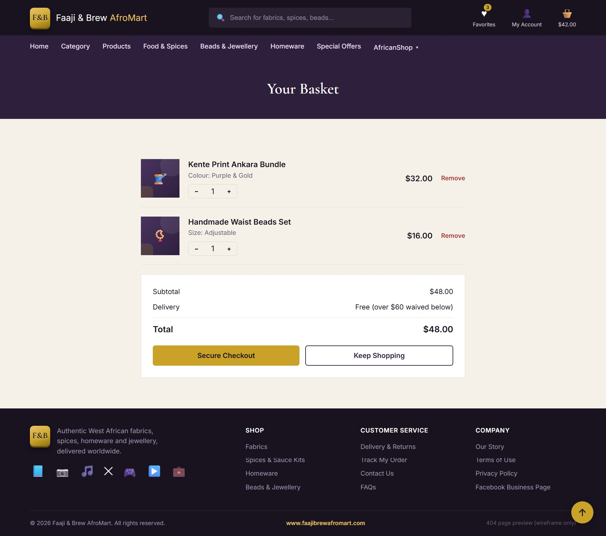

#### Checkout Page
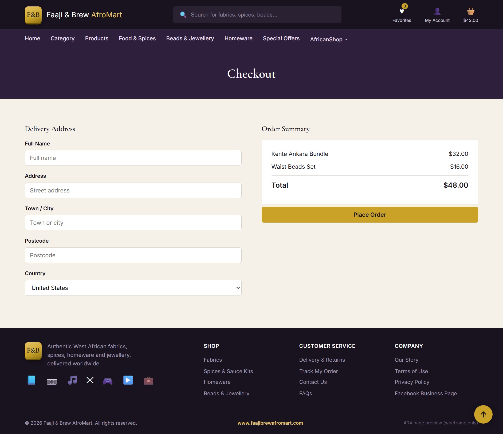

#### My Account Page
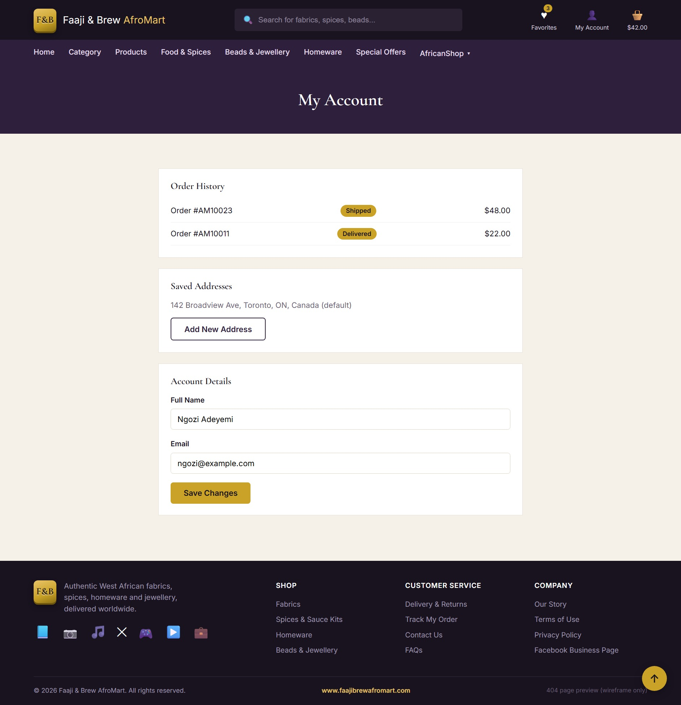

#### Favourites Page
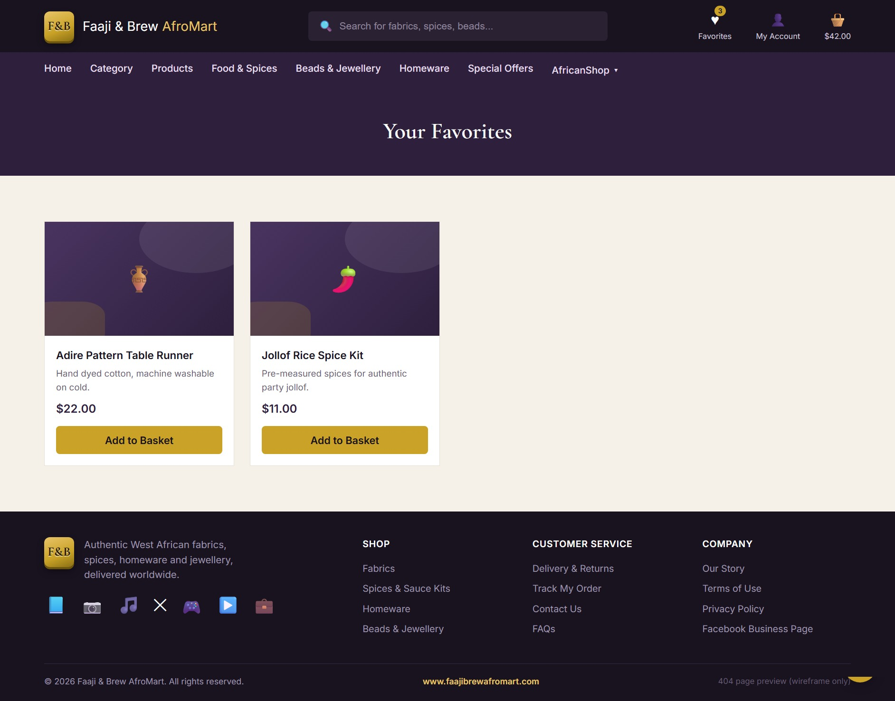

#### Login Page
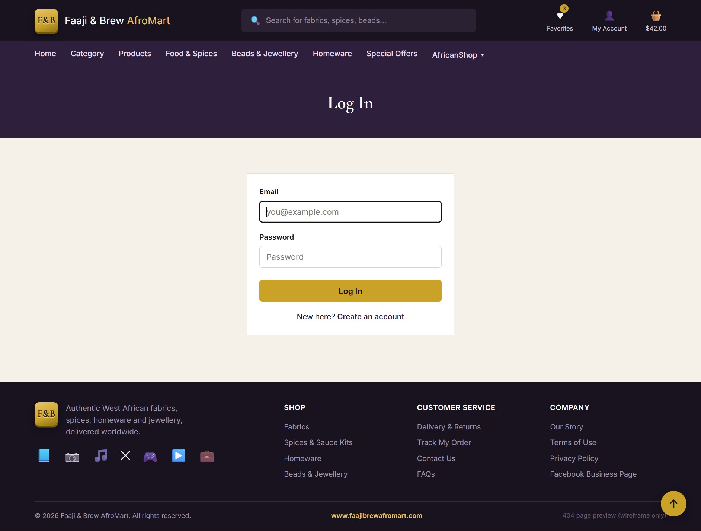

#### Register Page
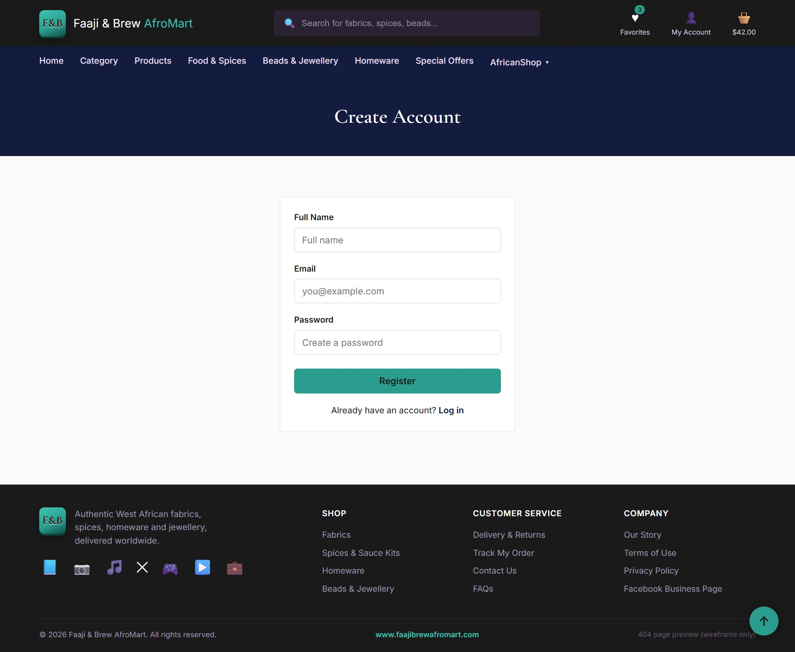

#### 404 Page
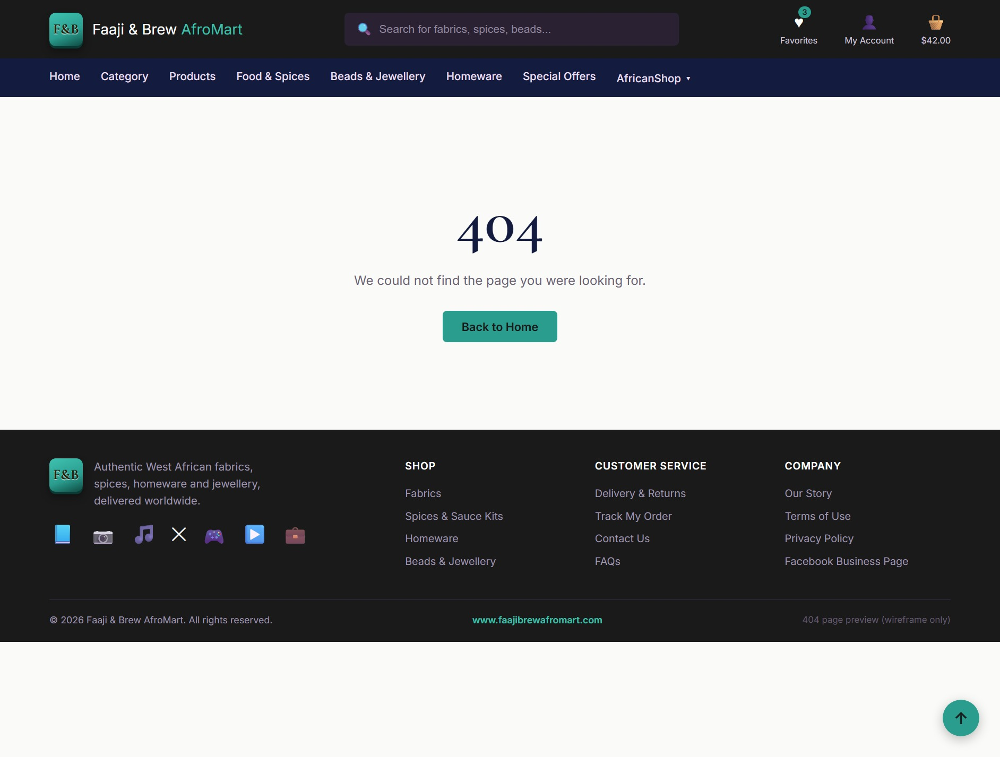

### Surface — Design System

**Colour palette**

| Swatch | Name | Hex | Used for |
|---|---|---|---|
| 🟦 | Indigo Deep | `#131B3F` | Primary dark backgrounds, navbar, footer |
| 🟦 | Indigo Mid | `#202A5E` | Gradient accents alongside Indigo Deep |
| 🟩 | Teal | `#2A9D8F` | Primary call-to-action colour, links, brand accent |
| 🟩 | Teal Light | `#3FC1B0` | Gradient partner to Teal, hover states |
| ⬜ | Cream | `#FAFAF8` | Main page background |
| ⬛ | Ink | `#1A1A1A` | Body text |

**Typography**

- **Headings** use *Cormorant Garamond*, a serif typeface chosen to give the brand an editorial, boutique feel rather than a generic tech-startup look.
- **Body text** uses *Inter*, a clean, highly legible sans-serif, keeping product descriptions and long-form text easy to read at any size.

**Imagery**

Product photography and lifestyle imagery were chosen to reflect genuine West African fabrics, spices, and craftsmanship, reinforcing the story behind the brand rather than using generic stock photography that could belong to any store.

---
