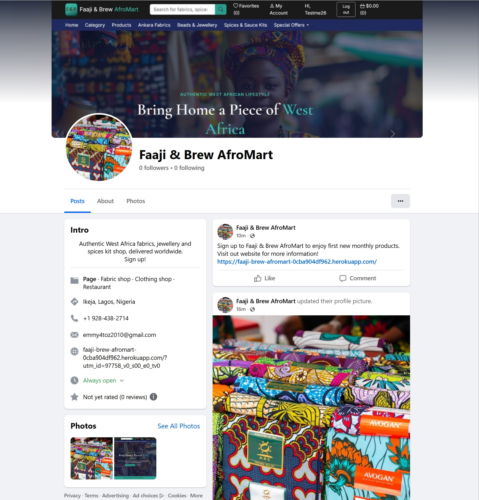

# faaji-brew-afromart

An e-commerce app created for the purpose of meeting the assessment criteria of my final portfolio project 5 as a full-stack software developer from Code Institute, Dublin, Ireland. I built this fully functioning e-commerce website.

**Portfolio Project 5 — A final E-Commerce Project for a Level 5 Diploma in Full-Stack Software Development**
**Code Institute, Dublin**

---

## Table of Contents

1. [About the Project](#about-the-project)
2. [UX Design](#ux-design)
   - [Strategy](#strategy)
   - [User Stories](#user-stories)
   - [Wireframes](#wireframes)
   - [Design System](#design-system)
3. [Features](#features)
   - [Existing Features](#existing-features)
   - [Future Features](#future-features)
4. [Marketing](#marketing)
   - [Facebook Business Page](#facebook-business-page)
5. [Data Model](#data-model)
6. [Agile Methodology](#agile-methodology)
7. [Technologies Used](#technologies-used)
8. [Testing](#testing)
9. [Validation](#validation)
10. [Deployment](#deployment)
    - [Local Development](#local-development)
    - [Heroku Deployment](#heroku-deployment)
11. [Credits](#credits)

---

## About the Project

### Wireframes

All wireframes were created before development began to define the page structure, user flow, and visual design of the application.

#### Home Page

#### Category Page

#### Products Page

#### Products Detail Page

#### Our Story Page

#### Basket Page

#### Checkout Page

#### My Account Page

#### Favorites Page

#### Login Page

#### Register Page

#### 404 Page

---

## Marketing

### Facebook Business Page

A real Facebook Business Page was created for Faaji & Brew AfroMart as part of the site's marketing strategy, linking back to the live store from the page's intro, about section, and posts.

[View the Facebook Business Page](https://www.facebook.com/share/17QgB9TWdd/)

The page is also linked from the site's footer, under the social icons and the Company column, opening in a new tab.

