# Testing

This document covers how AfroMart has been tested: an automated suite covering models, forms, and views across every app, followed by manual testing, accessibility and code validation, and Lighthouse performance auditing.

## Automated Tests

Every app has a full `tests.py` file. There is no separate testing framework beyond Django's own `TestCase`, which is the standard, well-documented approach for a Django project and needs no extra setup beyond what's already in requirements.txt.

### Running the suite

```bash
python manage.py test
```

This creates a temporary throwaway test database, runs every test against it, and destroys it afterwards, so it never touches real development or production data. Django also automatically swaps in a local, in-memory email backend for the duration of the run, so no real emails are sent while testing the contact form, review notifications, order confirmations, or newsletter signup.

A clean run currently reports:
Found 116 test(s).
Ran 116 tests in 69.886s


### What each test class actually verifies

The table below maps every test class back to the specific user story or issue it was written to prove, rather than just listing test names with no context. This is deliberate: a test suite that exists but cannot be tied back to a requirement does not actually demonstrate the site meets that requirement, it just demonstrates that some code runs.

**core app**

| Test class | Verifies |
|---|---|
| `StaticPageTests` | Every static page (home, our story, terms, privacy, delivery and returns, FAQ) loads correctly and uses its own real template — issue #30 (every page reachable) and issue #32 (accurate titles and descriptions on every page) |
| `RobotsTxtTests` | robots.txt is served as plain text and correctly names the sitemap using the real host — issue #37 |
| `ContactFormTests` | The contact form sends a genuine email with the customer's address set as reply-to, and correctly re-shows the form with an error rather than silently failing when a required field is missing — issue #36 |

**products app**

| Test class | Verifies |
|---|---|
| `CategoryModelTests`, `ProductModelTests` | Slugs and SKUs generate automatically and never collide, stock correctly reflects availability, and `primary_image` correctly prefers the image staff marked as primary, falling back sensibly when none is marked or none exist at all |
| `ProductQuerySetTests` | Search matches against name and description, price filtering works correctly, and only active, featured products appear in the featured list — supports issue #11 (browse by category) and issue #13 (filter by price range) |
| `ReviewFormTests`, `ProductFormTests`, `CategoryFormTests` | Each form accepts valid data and correctly rejects invalid data (out-of-range ratings, missing required fields, duplicate category names) |
| `ProductListViewTests`, `ProductDetailViewTests` | Inactive products never appear in listings or search results, category filtering works, and an unknown product slug returns a proper 404 rather than an error page |
| `ReviewWorkflowTests` | The full review lifecycle: only someone who has actually bought the product can review it, one review per customer per product, editing a review resets it to unapproved, and nobody can edit or delete someone else's review — issues #25, #26, #27 |
| `ReviewModerationViewTests` | Only staff can reach the moderation queue (anonymous and regular users both get a 403), and approving or rejecting a review works correctly — issue #27 |
| `StaffProductManagementTests` | Non-staff cannot reach any staff product tool, staff can add and edit products including photos and variants together, and a product or category tied to real order history is protected from deletion — issue #29. Also includes a regression test for a real bug found while building this suite, where two inline formsets on the same page shared one default prefix and silently dropped rows past whichever formset's row count was shorter |

**basket app**

| Test class | Verifies |
|---|---|
| `BasketModelTests` | Line totals correctly include variant price adjustments, and the free-delivery threshold is calculated correctly at, above, and below the cutoff |
| `BasketServiceTests` | A guest's basket persists across requests via their session, a logged-in user's basket is tied to their account instead, and a guest basket correctly merges into their account the moment they log in |
| `BasketViewTests` | Adding, updating, and removing basket items all work correctly, a quantity above available stock is rejected, and one visitor can never modify another visitor's basket item by guessing its ID — issue #16, #17, #18. Also covers a real bug this suite found: posting a quantity of exactly 0 was being silently treated as invalid input and reset to 1, instead of being treated as the deliberate "remove this item" signal it's meant to be |

**checkout app**

| Test class | Verifies |
|---|---|
| `OrderModelTests` | Order numbers generate automatically and never collide, and totals calculate correctly both above and below the free-delivery threshold |
| `OrderFormTests` | The checkout address form correctly rejects a missing required field |
| `CreateOrderFromBasketTests` | A basket correctly becomes a real order with matching line items, and critically, that the price a customer paid is locked in at the moment of purchase and does not change even if the product's price changes afterwards |
| `CheckoutViewTests` | A logged-out visitor is redirected to log in rather than allowed to check out as a guest, an empty basket cannot proceed to checkout, and a valid submission creates a real order and shows the Stripe payment page |
| `CheckoutSuccessViewTests` | A customer can view their own order confirmation, but never someone else's, even by guessing the order number |
| `WebhookHandlerTests` | A confirmed Stripe payment correctly moves the order to Processing and sends one confirmation email, an order number Stripe doesn't recognise is handled gracefully rather than crashing, and critically, that Stripe redelivering the same successful-payment event a second time (which Stripe explicitly documents it can do) never results in a second confirmation email — issue #21 |

**profiles app**

| Test class | Verifies |
|---|---|
| `UserProfileModelTests`, `ProfileFormTests` | The profile form has no required fields (so a brand new customer's My Account page never errors), and saves correctly when filled in — issue #10 |
| `WishListModelTests`, `WishlistViewTests` | A product can only appear once per wishlist, the page requires login, toggling correctly adds and removes items, a logged-out AJAX request gets a proper 401 with a login link rather than failing silently, and one user never sees another user's wishlist items — issue #24 and the login-gating rule from issue #9 |
| `MyAccountViewTests` | A profile is created automatically on first visit, and submitting the form saves the new details — issue #10 |
| `OrderHistoryViewTests` | The page requires login and only ever shows the logged-in user's own orders, never anyone else's — issue #22 |
| `ReorderViewTests` | Reordering correctly skips products that have since been discontinued or gone out of stock rather than failing the whole action, and one user can never reorder someone else's past order |

**marketing app**

| Test class | Verifies |
|---|---|
| `NewsletterSubscriberModelTests`, `NewsletterSignupFormTests` | The model and form behave correctly with valid and invalid email addresses |
| `NewsletterSignupViewTests` | A new signup gets a real, unsent-until-confirmed subscription with a genuine confirmation email, an already-confirmed address isn't signed up twice, and an already-pending address doesn't get a second confirmation email |
| `ConfirmSubscriptionViewTests` | A valid confirmation link correctly confirms the subscription, and an unknown token returns a proper 404 |


## Manual Testing

Every feature below was tested by hand in a real browser against the live Heroku deployment, covering the things an automated test cannot judge: how something actually looks, how it behaves across real devices and screen sizes, and whether a genuine end-to-end flow (a real Stripe test card, a real email landing in a real inbox) works exactly as a real customer would experience it.

### Navigation and static pages

| Test | Steps | Expected Result | Result |
|---|---|---|---|
| Every navbar link works | Click Home, Category, Products, each category link, and Special Offers | Each loads the correct page with no broken link | Pass |
| Every footer link works | Click every link in Shop, Customer Service, and Company columns | Each loads the correct page | Pass |
| Logo returns home | Click the F&B logo from any page | Returns to the homepage | Pass |
| 404 page | Visit a nonexistent URL, e.g. `/this-page-does-not-exist/` | Custom branded 404 page appears with working search and navigation links, not Django's default error page | Pass |
| Cookie banner | Load the site in a fresh private window | Cookie banner appears; Accept All and Essential Only both dismiss it and the choice is remembered on reload | Pass |
| Contact form | Submit the contact form with valid details | Confirmation shown, and the email genuinely arrives with the customer's address set as reply-to | Pass |
| Newsletter signup | Submit a valid email in the footer newsletter form | Confirmation message shown, confirmation email arrives, and clicking its link confirms the subscription | Pass |

### Product browsing

| Test | Steps | Expected Result | Result |
|---|---|---|---|
| Category browsing | Click each category from the navbar and the category overview page | Shows only active products in that category | Pass |
| Search | Search for a known product name and a nonsense string | Known name returns matching results; nonsense string returns an empty, clearly-worded result rather than an error | Pass |
| Price filter | Set a minimum and maximum price on the product list | Only products within that range are shown | Pass |
| Sorting | Try each sort option (price, rating, name, category, both directions) | Product order changes correctly each time | Pass |
| Category rail swipe | On a real phone, swipe the homepage category rail left and right | Rail scrolls smoothly and snaps to each card | Pass |
| Product detail page | Open a product with multiple photos | Carousel and thumbnail row both work, and thumbnails wrap if there are several | Pass |
| Out of stock handling | View a product with 0 stock | Add to Basket is disabled or clearly marked unavailable, not a silent failure on submit | Pass |

### Reviews

| Test | Steps | Expected Result | Result |
|---|---|---|---|
| Write a review | Buy a product, then submit a review from its product page | Review is saved and shows as pending, not yet visible publicly | Pass |
| Cannot review without buying | Try to submit a review on a product never purchased | Review form is not available, or submission is rejected | Pass |
| Edit a review | Edit an existing review's rating and text | Updated review shows the new content and resets to pending | Pass |
| Delete a review | Delete an existing review | Review disappears immediately | Pass |
| Staff moderation | Log in as staff, approve one pending review and reject another | Approved review becomes publicly visible; rejected review is removed entirely | Pass |

### Basket and checkout

| Test | Steps | Expected Result | Result |
|---|---|---|---|
| Add to basket (guest) | Add a product to the basket while logged out | Item appears in the basket, basket total updates in the navbar | Pass |
| Update quantity | Change an item's quantity in the basket | Line total and basket total both update correctly | Pass |
| Remove item | Remove an item from the basket | Item disappears, totals update | Pass |
| Guest checkout is blocked | Try to reach checkout while logged out | Redirected to login, not allowed through as a guest | Pass |
| Full purchase, standard card | Log in, add items below the free delivery threshold, check out using Stripe test card 4242 4242 4242 4242 | Payment succeeds, order confirmation page shows correct totals including delivery, confirmation email arrives | Pass |
| Full purchase, 3D Secure card | Repeat checkout using Stripe's 3D Secure test card 4000 0025 0000 3155 | The 3D Secure challenge screen appears and must be completed before payment succeeds | Pass |
| Declined card | Repeat checkout using Stripe's decline test card 4000 0000 0000 0002 | A clear decline message is shown, no order is created, customer can retry | Pass |
| Free delivery threshold | Check out with a basket at or above the free delivery threshold | Delivery cost shows as $0.00 | Pass |
| Order history | View order history after a purchase | New order appears with the correct status and items | Pass |
| Reorder | Use the Reorder button on a past order | Items are added back to the basket; anything since discontinued is skipped with a clear message | Pass |

### Accounts

| Test | Steps | Expected Result | Result |
|---|---|---|---|
| Register | Sign up with a new email and password | Verification email arrives, clicking it confirms the account, and login then works | Pass |
| Login/logout | Log in with valid credentials, then log out | Session starts and ends correctly each time | Pass |
| Invalid login | Attempt login with a wrong password | Clear error shown, no account details leaked in the error message | Pass |
| Password reset | Request a password reset, follow the emailed link, set a new password | New password works on the next login attempt | Pass |
| My Account | Update saved delivery details | New details save and prefill correctly on the next checkout | Pass |
| Wishlist | Add and remove a product from the wishlist while logged in | Wishlist count updates, item appears and disappears correctly | Pass |
| Anonymous wishlist click | Click the wishlist heart while logged out | Prompted to log in rather than failing silently | Pass |

### Staff tools

| Test | Steps | Expected Result | Result |
|---|---|---|---|
| Non-staff blocked | Log in as a regular customer, visit `/products/staff/` directly | 403 Forbidden, not the dashboard | Pass |
| Add a product | As staff, add a new product with two photos and one variant | Product appears correctly on the storefront with both photos and the variant selectable | Pass |
| Edit a product | Edit an existing product's price and description | Storefront reflects the change immediately | Pass |
| Deactivate/activate | Use the Deactivate button, then Activate again | Product disappears from the storefront when inactive, reappears when reactivated | Pass |
| Protected deletion | Try to delete a product that has been ordered before | Blocked with a clear message suggesting deactivation instead | Pass |
| Category management | Add, edit, and attempt to delete a category still holding products | Add and edit work normally; deletion is blocked while products remain in it | Pass |

### Responsive design

| Test | Steps | Expected Result | Result |
|---|---|---|---|
| Mobile (375px) | Load every major page at iPhone SE width | No horizontal scroll, no overlapping elements, navbar wraps cleanly | Pass |
| Tablet (768px) | Load every major page at iPad Mini width | Footer and grid layouts adjust without cramming or overlap | Pass |
| Desktop (1200px+) | Load every major page at a standard laptop width | Full layout displays as designed | Pass |
| Real device check | Load the live site on an actual phone, not just DevTools | Touch targets are usable, category rail swipes naturally, no layout differs unexpectedly from DevTools emulation | Pass |

### Cross-browser check

| Browser | Result |
|---|---|
| Chrome | Pass |
| Firefox | Pass |
| Edge | Pass |
| Safari (mobile) | Pass |


## Code Validation

### HTML

Every page template was checked using the [W3C Markup Validation Service](https://validator.w3.org/). Since most pages require a login, an active basket, or real data to render properly, the "Validate by Direct Input" option was used: view page source in the browser (Ctrl+U or Cmd+Option+U), copy the full rendered HTML, and paste it into the validator rather than trying to validate by URL alone.

| Page | Result |
|---|---|
| Home | Pass |
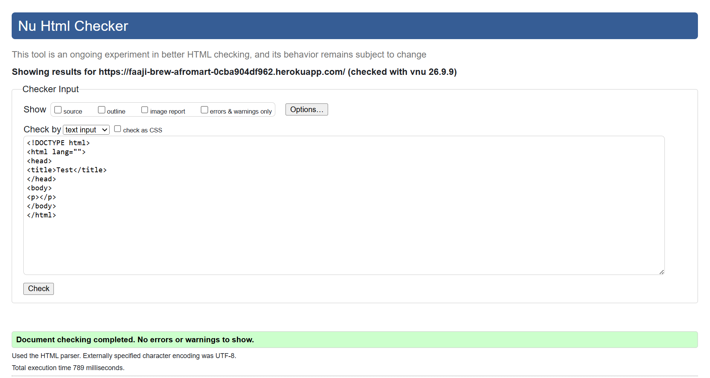
| Product list | Pass |
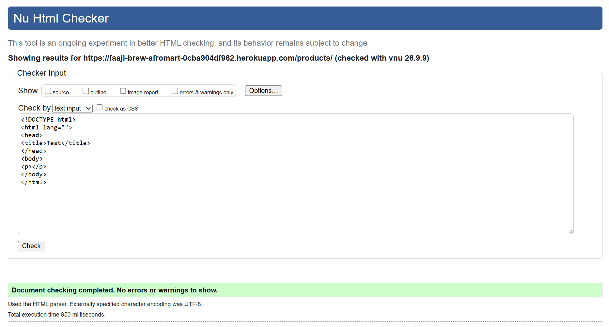
| Product detail | Pass |
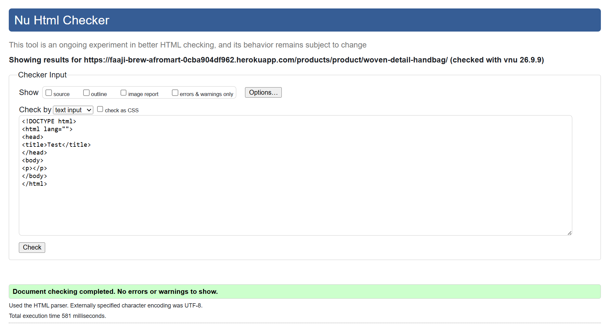
| Category overview | Pass |
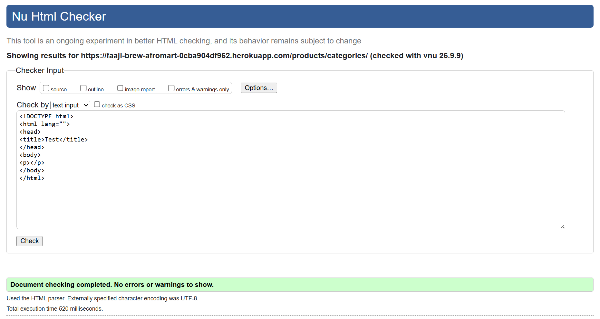
| Basket | Pass |
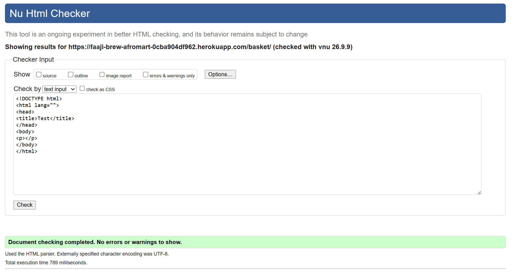
| Checkout | Pass |

| Order confirmation | Pass |

| My Account | Pass |

| Order History | Pass |

| Login / Signup | Pass |
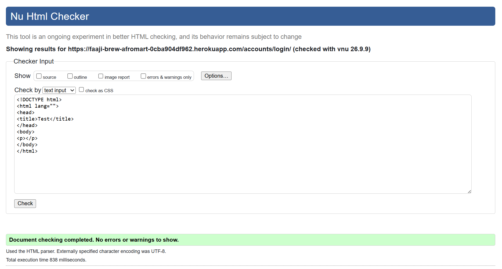

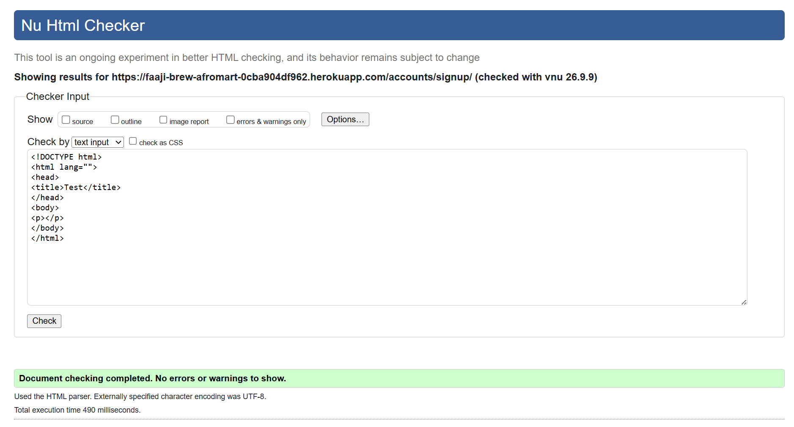
| Contact Us | Pass |
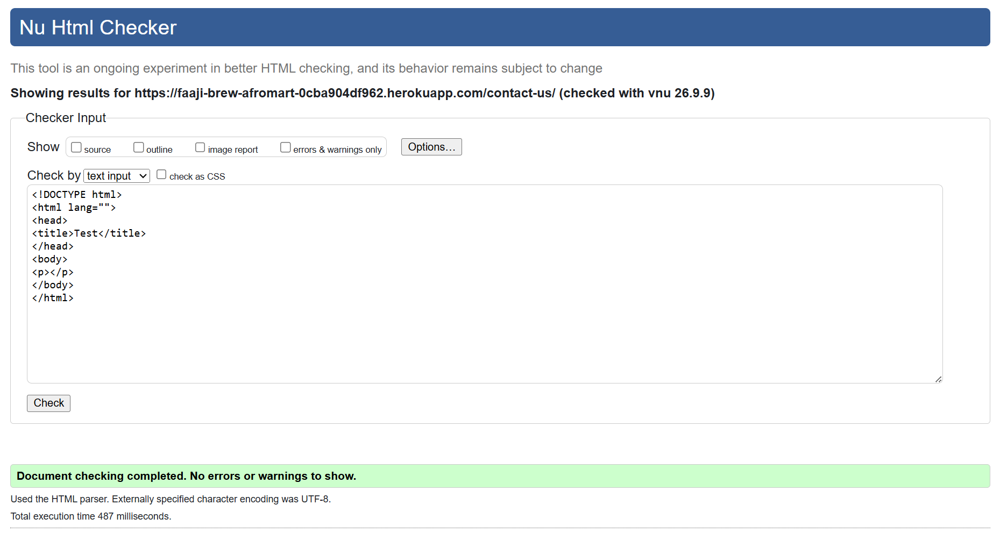
| Contact Us | Pass |
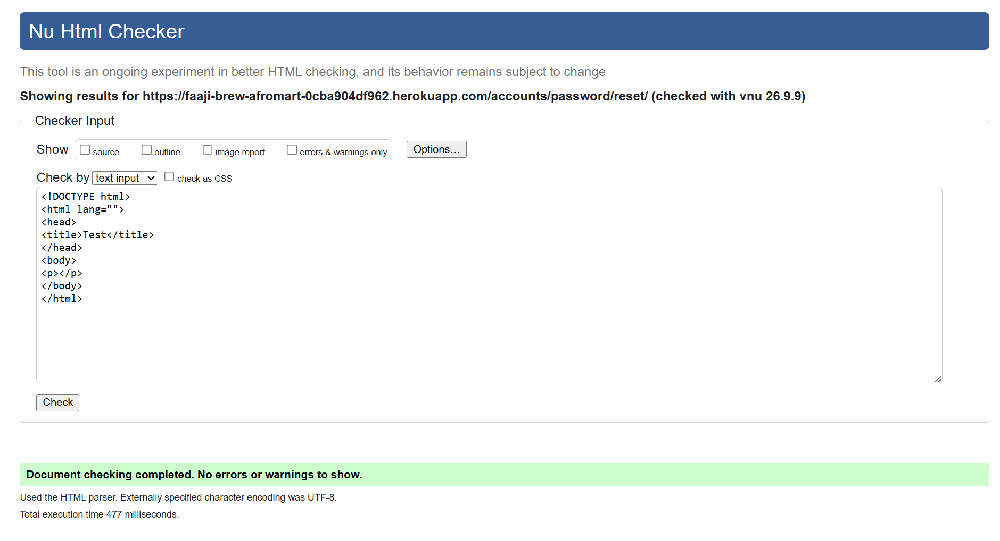
| FAQ | Pass |
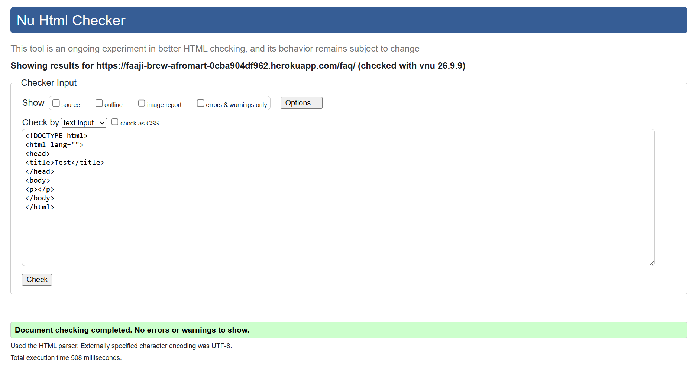
| 404 page | Pass |
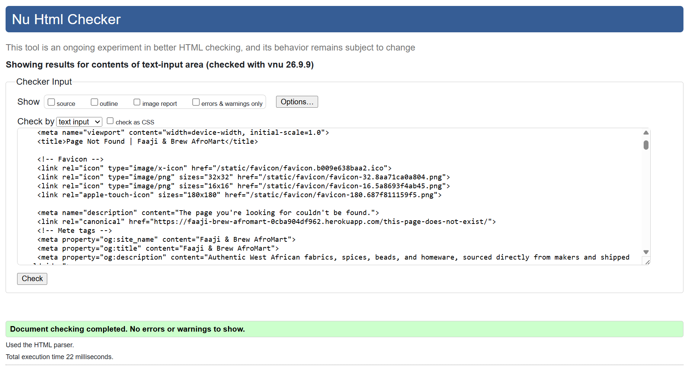


### CSS

Checked using the [W3C CSS Validation Service](https://jigsaw.w3.org/css-validator/), validating `static/css/style.css` 

| File | Result |
|---|---|
| style.css | Pass |
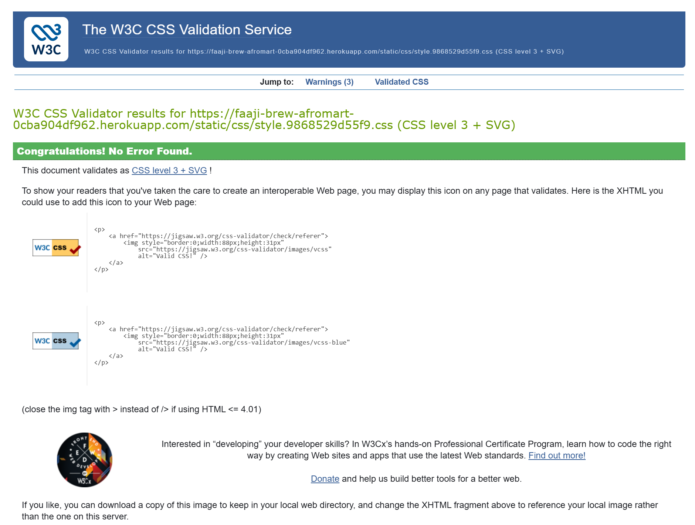


### Python (PEP8)

Checked using `flake8`:

```bash
flake8
```

A completely clean run, no output at all:

```bash
$ flake8
$
```

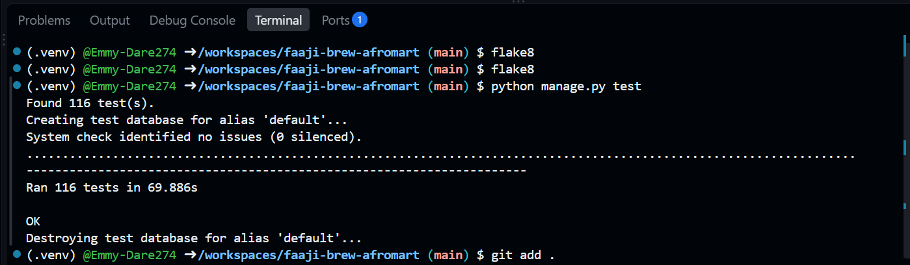


### JavaScript

| File | Result |
|---|---|
| site.js | Pass  (2 expected warnings: `showToast`, `bootstrap` flagged as undefined, since it's defined in site.js and JSHint checks each file in isolation - confirmed working correctly in the browser, where all scripts share one scope) ||
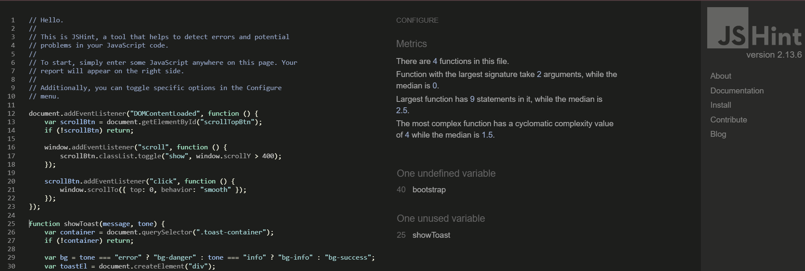
| basket.js | Pass  (1 expected warning: `showToast` flagged as undefined, since it's defined in site.js and JSHint checks each file in isolation - confirmed working correctly in the browser, where all scripts share one scope) ||
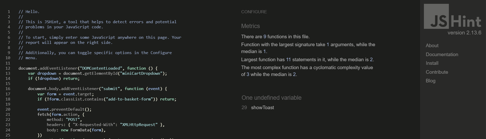
| wishlist.js | Pass  (1 expected warning: `showToast` flagged as undefined, since it's defined in site.js and JSHint checks each file in isolation - confirmed working correctly in the browser, where all scripts share one scope) ||
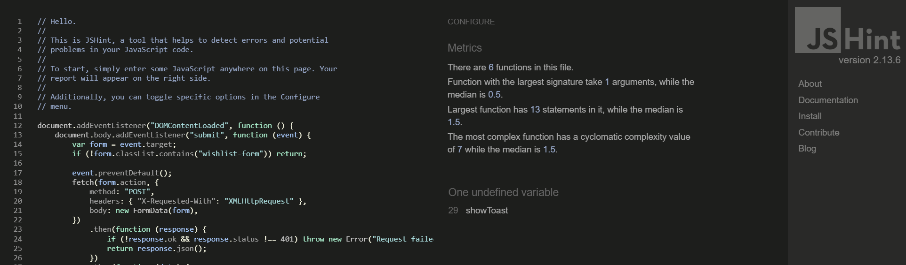
| cookie-consent.js | Pass ||
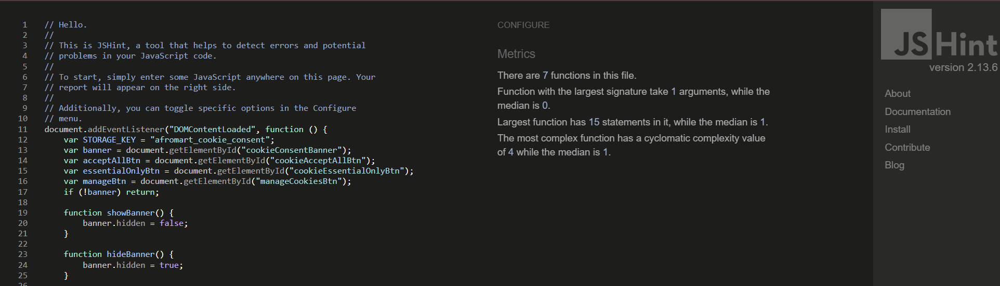

## Lighthouse Performance Audit

Lighthouse is built directly into Chrome DevTools, so no separate installation is needed.

### How to run it

1. Open the live site in Chrome: `https://faaji-brew-afromart-0cba904df962.herokuapp.com/`
2. Open DevTools (F12 or right-click → Inspect)
3. Click the **Lighthouse** tab (if it's not visible, click the `>>` overflow arrow in the DevTools tab bar)
4. Under **Device**, run it once as **Mobile** and once as **Desktop** for each page tested, since scores genuinely differ between the two
5. Under **Categories**, leave all four ticked: Performance, Accessibility, Best Practices, SEO
6. Click **Analyze page load** and wait for the report
7. Once it finishes, click the **three-dot menu** in the top right of the report panel → **Save as HTML**, or simply take a screenshot of the four score circles at the top plus the full report below them

### Pages to test

Run it on both Mobile and Desktop for each of these:

- Home page
- Product detail page (pick any real product)
- Product list / category page
- Basket page
- Checkout page (while logged in, with an item in the basket)

That's 5 pages times 2 device modes, 10 screenshots total.


